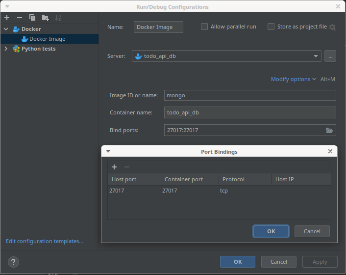
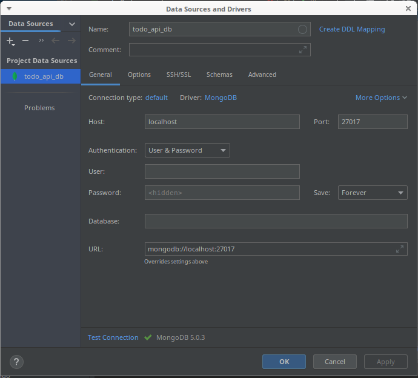

# api-todo
A simple todo list API

## Alguns comandos executados

### commands to create a project directory
  - cd PycharmProjects
  - mkdir api-todo
  - cd api-todo
  - pyenv versions
    - system
    - 3.8.0
    - 3.8.1
    - 3.9.5
    * 3.9.7 (set by /home/plautz/PycharmProjects/api-todo/.python-version)

  - pyenv update
    
  - pyenv install --list
  - pyenv install 3.9.7
  - pyenv install --list
  - pyenv versions
  - pyenv local 3.9.7
  - python -m venv .venv
  - python -m venv .venv/bin/activate
  - pip install poetry
  - poetry version
  - poetry -V
  - poetry self update
  - poetry -V
  - 
### with poetry we can initializate our project
  - poetry init
    - package name [api-todo]:
    - Version [0.1.0]:
    - Description []:A simple todo list API 
    - authors = ["61246880 <jorge.plautz@gmail.com>"]
    - license = "GPLV3+"
    - Compatible Python version[^3.9]: # carrega a versão 3.9 ou maior
    - Would you like to define your main dependencies interactively? (yes/no) [yes]: no
    - Would you like to define your development dependencies interactively? (yes/no) [yes]: no
    - ... list all configuration parameters that is going to be in the pyproject.toml file
    - Do you confirm generation? (eyes/no) [yes]
    
### access github via browser - create a new project and copy the link 
  - copy the links to be used in the project directory
  - create a new issue "1-create a virtual environment"

### Commands to manager the project versioning by git

| Command                        | Description                                                                 |
|--------------------------------|-----------------------------------------------------------------------------|
| git init                       | Create an empty Git repository or reinitialize an existing one              |
| git remote -v                  | Create an empty Git repository or reinitialize an existing one              |
| git remote add origin git@github.com:jlplautz/api-todo.git | create a origin                                 | 
| git fetch all                  | Download objects and refs from another repository to synchronize the branch |
| git fetch --all                | Fetch all remotes                                                           |


### Creating project directory 

| Command                        | Description                                      |
|--------------------------------|--------------------------------------------------|
| mkdir api-todo                 |                                                  |
| source .venv/bin/activate      | activating virtual environment                   |                             


### pyproject.toml usa um novo padrão de projeto. Este arquivo é usado para configuração do projeto no python

## Libs instaladas
  - poetry add --dev requests  

  - poetry add pytest-cov codecov

## issue 1-startprojec
| Command                        | Description                                                |
|--------------------------------|------------------------------------------------------------|
| git checkout -b 1-startproject | load the branch number 1 in the local machine (laptop)     |
| git status                     | Fetch all remotes                                          |
| git add pyproject.toml         | Add file contents to the index                             |
| git commit -m 'Started project'| Record changes to the repository                           |
| git push origin 1-startproject | Update remote refs along with associated objects           |
| git checkout main              | go to main branch                                          |
| git fetch --all                | fetch from all remotes                                     |

### Pycharm is possible to create via menu Tools/Tasks&Contexts/
  - configure Servers
  


## issue 2-Install and setup fastApi


## issue 3-Install and setup pytest
  - poetry add --dev flake8
  - poetry add --dev pytest
  - configure the follow lines in the pyproject.toml file.
  
  | Inside pyproject.toml file insert        |
  |------------------------------------------|
  | [tool.pytest.ini_options]                |
  |  python_files = [                        |
  |        "test*.py",                       |
  |        "*tests.py",                      |
  | ]                                        |
  |  minversion = "6.0"                      |
  |  addopts = "-ra -q -v"                   |
  |  testpaths = ["api/tests", ]             |


## issue 5-Install and setup pydantic
  - poetry add fastapi uvicorn[standard]
    - fastapi -> framework of api
    - uvicorn -> server that is going to provide de response
  - create a python package api
     - inside of this package create a file main.py
        - the program in the file is very similar to flask
        - let go to create our first route that is going to return a json
  - create a python package tests
     - create a first test_main.py
        - import one dependency -> from starlette.testclient import TestClient
        - in the  setting define pytest as default
     - import lib request for test environment it is necessary for fastapi
     - the second test- test_main_return_message
       - tips -> assert response.json() == '' with empty response just to see the error than copy de message
       - from error and insert in the test
  - to run our api in the terminal
     - uvicorn api.main:app --reload
  
  - via terminal you can call by curl command
     - ╭─plautz@ProBook-6470b ~ 
       ╰─$ curl -X 'GET'  'http://127.0.0.1:8000/' -H 'accept: application/json'
       {"message":"Ola, funcionou. Estamos respondendo da raiz da API!!!"}%       

## issue 11-setup Github Actions
   - create a directory .github
     - create a directory workflows
        - create a file ci.yml 
     - copy the yml file as example from -> https://github.com/abatilo/actions-poetry

## issue 13 - Install and set up codecov and codecoverage
  - poetry add --dev pytest-cov codecov
  - configurar
     - create a file .coveragerc at project root
        - insert in the file -> omit = api/test -> tests is not going to cover the test directory
     - create a file codecov.yml -> copy from codecov documentation as default
  - para rodar o teste -> pytest --cov='.'
  - insert in the file ci.yml -> the instruction --cov='.'
     - run: poetry run pytest --cov='.' -v  

## Issue 15 -  Prepare API Structure to receive two resources - user + todo
  - the idea is creating the project structure
     - two python package 
        - user
        - todo
  ╰─$ tree -d  
  .
  ├── api              -> project directory
  │   ├── tests  -> directory for tests to api
  │   ├── todo   -> API resource for task list
  │   └── user   -> User resource to manage the users.
  └── images

  - the follow lines was inserted in the github workflows
      - name: Send report to codecov.io
        run: poetry run codecov

## issue 17- Install and setup MongoEngine Database
  - Install lib MongoEngine
      - poetry add mongoengine  -> mongoengine usa pymongo
      - mongo is a bank notsql (it is not a relacional bank)
      - sqlite is a relacional bank
  - Configurar o docker no menu -> Edit Configuration

   
  - Database checking 

   

  - Connect API with MongoEngine 
    - in the file main.py insert:
      mongoengine.connect('todo_api_db', host='mongodb://localhost')
    
  - Create a python file conftest.py
    - from api/test/tests_main copy (CTRL + X) -> client = TestClient(app)
       insert it in the file conftest.py
    - insert -> from api.main import app
    
    - Preparing fixture for test bank because fastapi don't have it, as Django has.
  
```
@pytest.fixture()
def mongo(scope='function'):
    # disconnect the default connection
    disconnect('default')
    # it is going to create a new DB connection and it is going to assign to variable db
    db = connect('test_db', host='mongodb://localhost')
    # this parameter yield is going to provide the db parameter and when the function finished it
    # it is going to return here to drop de bank.
    yield db
    db.drop('test_db')
    disconnect('default')
```

  - file conftest.py is going to be moved to root directory 

